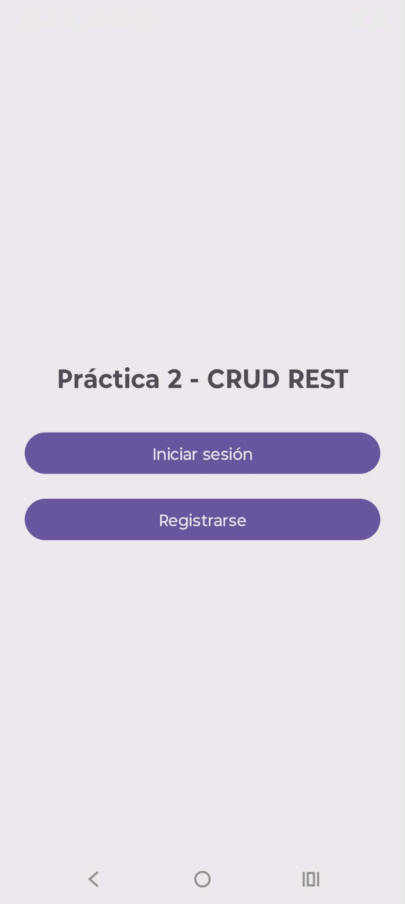
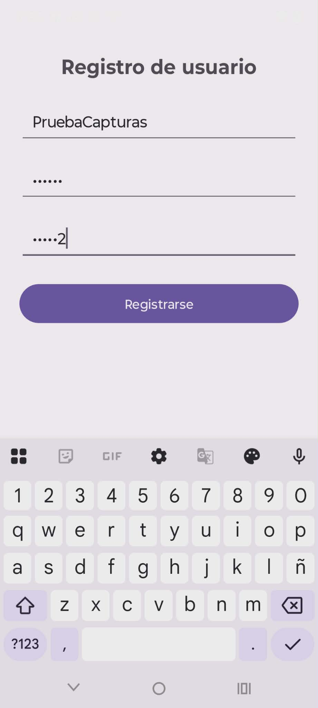
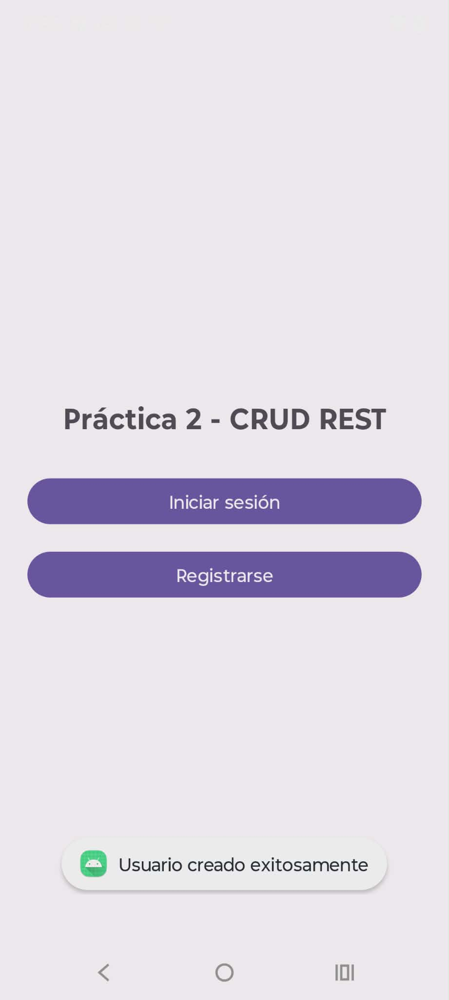
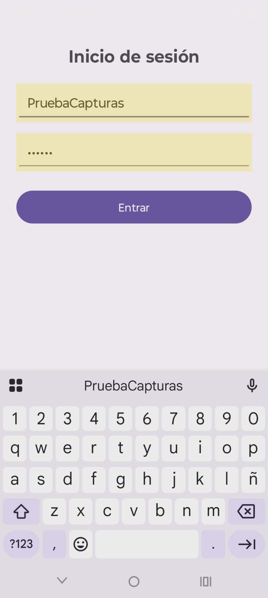
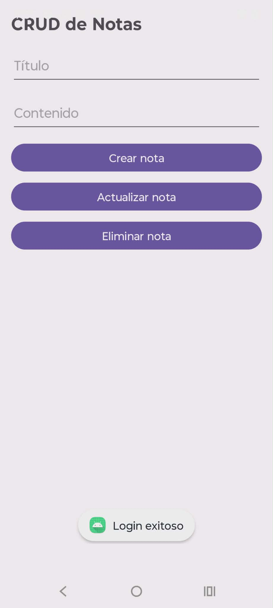
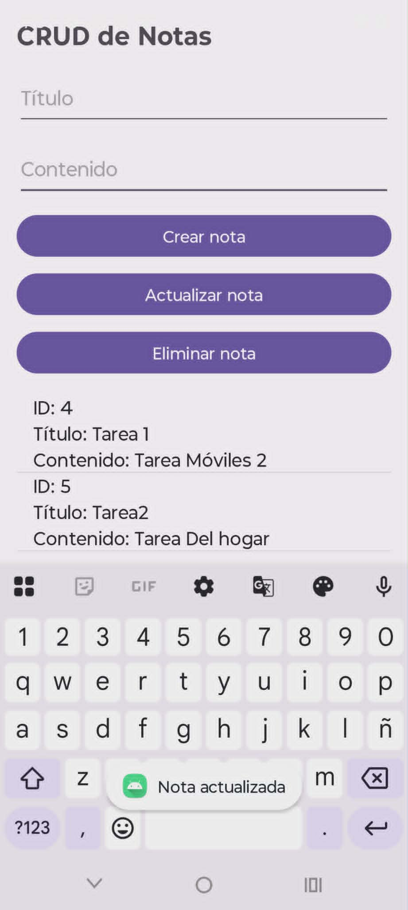
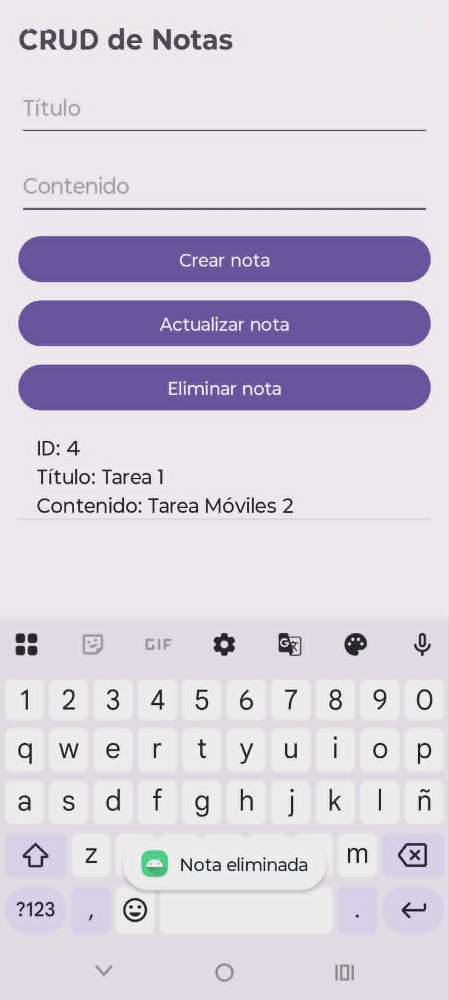

# 📱 Práctica 2 - CRUD REST (Android + Flask)

- **Nombre:** Jose Alfredo Ramirez Aguirre
- **Materia:** Desarrollo de Aplicaciones Móviles

---

## 📌 Introducción

En esta práctica se desarrolló una aplicación móvil en Android que consume un servicio REST implementado en Flask.  
La aplicación permite a los usuarios registrarse, iniciar sesión y realizar operaciones CRUD (Crear, Leer, Actualizar y Eliminar) sobre notas.

Se implementó autenticación mediante JWT para garantizar la seguridad en las sesiones, además de encriptación de contraseñas en el backend.

---

## 🔐 Seguridad implementada

- Contraseñas encriptadas
- Autenticación con JWT
- Validación de contraseña (mínimo de caracteres)
- Endpoints protegidos

---

## 📸 Evidencia de ejecución

### 🔹 Pantalla principal (inicio de la app)

---

### 🔹 Registro de usuario

---

### 🔹 Usuario registrado exitosamente

---

### 🔹 Inicio de sesión

---

### 🔹 Login exitoso

---

### 🔹 Crear nota

---

### 🔹 Actualizar nota

---

### 🔹 Eliminar nota

---

## 🧠 Desarrollo

### Backend (Flask)
- Endpoints:
  - `/register`
  - `/login`
  - `/notes`
- Uso de JWT para autenticación
- Encriptación de contraseñas

### Frontend (Android)
- Interfaces de usuario:
  - Registro
  - Login
  - CRUD
- Consumo de API con Retrofit
- Manejo de token JWT

---

## ✅ Conclusiones

Se logró implementar una aplicación completa con arquitectura cliente-servidor, incluyendo autenticación segura mediante JWT y operaciones CRUD funcionales.

Uno de los principales retos fue la integración entre Android y el backend, así como la implementación de seguridad.

---

## 📚 Bibliografía
Pallets Projects. (2024). *Flask Documentation*. Recuperado de https://flask.palletsprojects.com/

Google. (2024). *Android Developers Documentation*. Recuperado de https://developer.android.com/

Square, Inc. (2024). *Retrofit Documentation*. Recuperado de https://square.github.io/retrofit/

Auth0. (2024). *Introduction to JSON Web Tokens*. Recuperado de https://jwt.io/introduction
